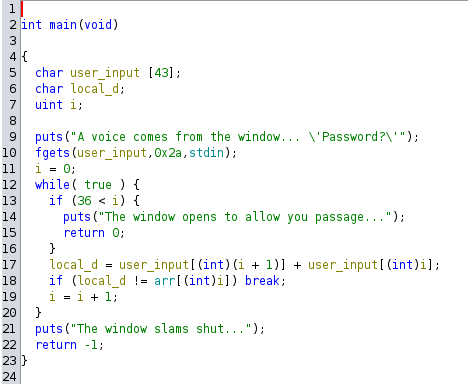
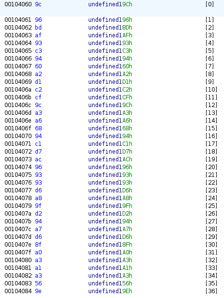

+++
date = '2023-12-11T23:00:00+02:00'
draft = false 
title = 'Windows of opportunity'
tags = [ 'reverse' ]
+++

To look at the writeup in english, click [here](#english).

# Français
## Examen du fichier binaire
On nous donne un fichier binaire.

Un petit `file` pour avoir quelques infos : 
```
windows: ELF 64-bit LSB pie executable, x86-64, version 1 (SYSV), dynamically linked, interpreter /lib64/ld-linux-x86-64.so.2, BuildID[sha1]=121c16ba1218dc3686b3cdac4705bc7496fb0fe7, for GNU/Linux 3.2.0, not stripped
```

C'est bien un exécutable qu'il va donc falloir décompiler.
On peut faire un `string`, mais pas grand-chose d'intéressant.

On lance ghidra et on obtient ceci :


Ce code va ajouter deux à deux les valeurs ASCII de l'entrée de l'utilisateur et les comparer à un tableau `arr` stocké quelque part en mémoire. 
Par exemple : si on entre  `ABCD` le programme vas vérifier si `arr` contient `[131, 133, 135]`.

En examinant la mémoire (j'ai cliqué sur le nom tout simplement.) on trouve ceci :


## Reconstitution du flag

Il faut donc reconstituer un input valide, pour cela, je sors mon meilleur ami : python
```python
a = (0x9c, 0x96, 0xbd, 0xaf, 0x93, 0xc3, 0x94, 0x60, 0xa2, 0xd1, 0xc2, 0xcf, 0x9c, 0xa3, 0xa6, 0x68, 0x94, 0xc1, 0xd7, 0xac, 0x96, 0x93, 0x93, 0xd6, 0xa8, 0x9f, 0xd2, 0x94, 0xa7, 0xd6, 0x8f, 0xa0, 0xa3, 0xa1, 0xa3, 0x56, 0x9e)
# a est un tuple simulant arr

def get_pairs(number:int) -> list[str]:
    # Renvoie toutes les combinaisons de lettre permettant d'obtenir un chiffre (number)
    combinations = list()
    for i in range(33, 127):
        nb2 = number - i
        if nb2 >= 33 and nb2 <= 126:
            combinations.append(chr(i) + chr(nb2))
    return combinations

def char_series(strings_a:list[str], strings_b:list[str]) -> list[str]:
    # Permet de concatener les str entre elle si strings_a[i][-1] et strings_b[j][0] identique
    combinations = list()
    for i in strings_a:
        for j in strings_b:
            if i[-1] == j[0]:
                combinations.append((i + j[1:]))
    return combinations

pairs_of_a = list()
for i in a:
    pairs_of_a.append(get_pairs(i))
# On crée toutes les combinaisons de chiffre

answers = char_series(pairs_of_a[0], pairs_of_a[1])
for i in pairs_of_a[2:]:
    answers = char_series(answers, i)
print(answers)
# On les met toutes à la suite
```

On fait tourner le programme et on obtient :
```python
['HTB{4_d00r_cl0s35_bu7_4_w1nd0w_0p3n5!}', 'ISCz5^e/1q`bm/t26^ct8^5^x0oc1v`/q2o4"|', 'JRDy6]f.2paan.u17]ds9]6]y/pb2ua.r1p3#{', 'KQEx7\\g-3ob`o-v08\\er:\\7\\z.qa3tb-s0q2$z', 'LPFw8[h,4nc_p,w/9[fq;[8[{-r`4sc,t/r1%y', 'MOGv9Zi+5md^q+x.:Zgp<Z9Z|,s_5rd+u.s0&x', "NNHu:Yj*6le]r*y-;Yho=Y:Y}+t^6qe*v-t/'w", 'OMIt;Xk)7kf\\s)z,<Xin>X;X~*u]7pf)w,u.(v']
```
On a bien le flag, mais également d'autres input qui sont également valide.

# English

## Examination of the binary file

We are given a binary file.

A small `file` to grab some informations :
```
windows: ELF 64-bit LSB pie executable, x86-64, version 1 (SYSV), dynamically linked, interpreter /lib64/ld-linux-x86-64.so.2, BuildID[sha1]=121c16ba1218dc3686b3cdac4705bc7496fb0fe7, for GNU/Linux 3.2.0, not stripped
```

It is an executable so we will have to decompile it.
We can run `string`, but nothing interesting.

We start ghidra and obtain this :


This piece of code will add two by two the ASCII values of the user entry and compare them to an array names `arr` which is stored somewhere in memory.
For example : if we enter `ABCD` the programm will check wether or not `arr` contains `[131, 133, 135]`.

After looking up the memory we find this :


## Flag recreation

We have to create a valid input, to achieve this I bring my best friend : python
```python
a = (0x9c, 0x96, 0xbd, 0xaf, 0x93, 0xc3, 0x94, 0x60, 0xa2, 0xd1, 0xc2, 0xcf, 0x9c, 0xa3, 0xa6, 0x68, 0x94, 0xc1, 0xd7, 0xac, 0x96, 0x93, 0x93, 0xd6, 0xa8, 0x9f, 0xd2, 0x94, 0xa7, 0xd6, 0x8f, 0xa0, 0xa3, 0xa1, 0xa3, 0x56, 0x9e)
# a is a tuple to simulate arr

def get_pairs(number:int) -> list[str]:
    # Returns every combination of letters that creates a number
    combinations = list()
    for i in range(33, 127):
        nb2 = number - i
        if nb2 >= 33 and nb2 <= 126:
            combinations.append(chr(i) + chr(nb2))
    return combinations

def char_series(strings_a:list[str], strings_b:list[str]) -> list[str]:
    # Allows to concatenate the strings if strings_a[i][-1] and strings_b[j][0] are identical
    combinations = list()
    for i in strings_a:
        for j in strings_b:
            if i[-1] == j[0]:
                combinations.append((i + j[1:]))
    return combinations

pairs_of_a = list()
for i in a:
    pairs_of_a.append(get_pairs(i))
# We create the list of str for every number of a

answers = char_series(pairs_of_a[0], pairs_of_a[1])
for i in pairs_of_a[2:]:
    answers = char_series(answers, i)
print(answers)
# We put them all together
```

We run the programm and we obtain :
```python
['HTB{4_d00r_cl0s35_bu7_4_w1nd0w_0p3n5!}', 'ISCz5^e/1q`bm/t26^ct8^5^x0oc1v`/q2o4"|', 'JRDy6]f.2paan.u17]ds9]6]y/pb2ua.r1p3#{', 'KQEx7\\g-3ob`o-v08\\er:\\7\\z.qa3tb-s0q2$z', 'LPFw8[h,4nc_p,w/9[fq;[8[{-r`4sc,t/r1%y', 'MOGv9Zi+5md^q+x.:Zgp<Z9Z|,s_5rd+u.s0&x', "NNHu:Yj*6le]r*y-;Yho=Y:Y}+t^6qe*v-t/'w", 'OMIt;Xk)7kf\\s)z,<Xin>X;X~*u]7pf)w,u.(v']
```
We do get the flag but we also get more inputs that would also be valid.
