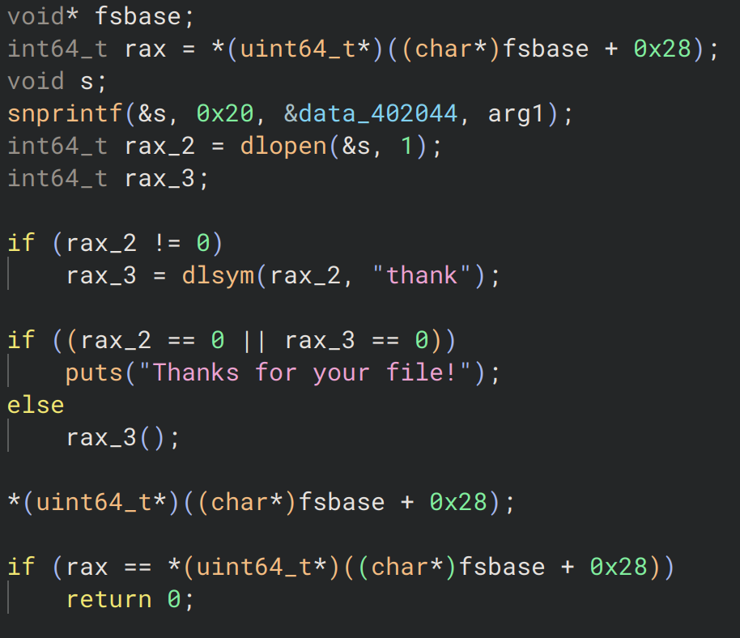

+++
date = '2024-09-30T12:00:00+02:00'
draft = false 
title = 'rev / thank'
tags = [ 'reverse' ]
+++

Description: I am so grateful for your precious files!  

nc challs.pwnoh.io 13373  

# First look

Connecting to netcat we get :
```
What is the size of your file (in bytes)?
1234
Send your file!
azerty
Thanks for your file!
```

Ok so we have to send a file.

# Decompiling

Lets open binary ninja and take a look.  
- We find the function asking for the file size : [file size function](ask_file_size.png)
- Space for the file is malloc'ed
- The file is then asked for and read  


- After some checks and I believe a write to the disk we get to the interesting part

# Exec function

We find an interesting function, after a bit of reading the manual we understand that `dlopen` opens a shared library object, `dlsym` finds a symbol in it and returns its address which is then executed by `rax3()`.
So we need to send a shared library object which contains a symbol `thank` (a function for example), and that function will get executed.
Let's do it !!



# Getting the flag

We write a small c program with a thank function.

```c
#include <stdio.h>

void thank(void){
    FILE* file = fopen("flag.txt", "r");
    char buff[101];
    fgets(buff, 100, file);
    printf("%s", buff);
}
```

We then compile it and send it to the server.

```bash
gcc -shared -fPIC -o exploit.so exploit.c
(echo `du -b exploit.so`; cat exploit.so) | nc challs.pwnoh.io 13373
```

And boom we get the flag (I didn't save it so can't put it here).
