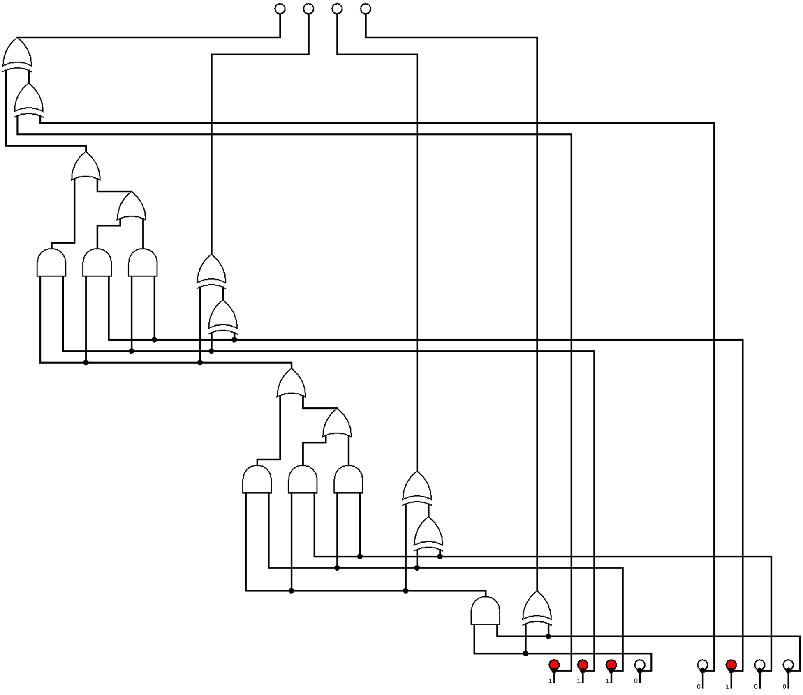

+++
date = '2025-04-27T14:23:22+02:00'
draft = false 
title = 'Badd Circuit (intro)'
tags = [ 'hardware' ]
+++

Title: Badd Circuit (intro)
Points: 25  
Number of solves: 512  
Description:  
Here is a logic circuit that implements an unknown function. What is the value of the four output bits?   
The flag format is `FCSC{<value>}`. For example, if the value to find is 0001, the flag would be FCSC{0001}.  

Two options here either rebuild the circuit in a digital simulator like the great [digital](https://github.com/hneemann/Digital) (the name is not that great but the software is). Or do it by hand wich is much faster.  
So I just wrote down what the ouput of each gate is (sometime you can skip some) and got the flag.  
I forgot to write it down and am too lazy to do it again so let's say that I leave it as an exercice for the reader.  
