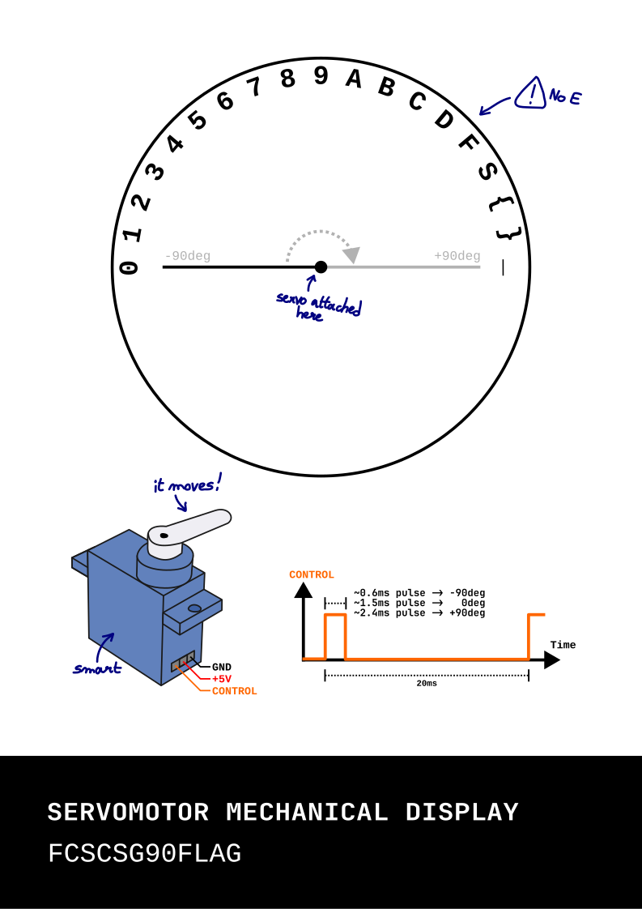

+++
date = '2025-04-27T14:23:22+02:00'
draft = false 
title = 'Mechanical Display'
tags = [ 'hardware' ]
+++

Title: Mechanical Display  
Points: 238  
Number of solves: 120  
Description:  
One of your team-mates has found a broken device. It looks like a clock, but there is only one hand pointing at some letters. You connect your logic analyser to a signal going to its only motor (mechanical-display.vcd). Can you find out what secret this object contains?  
Using the device model number, you manage to find a datasheet online (public/mechanical-display-datasheet.pdf).



That is a beautiful professional looking datasheet.  
So according to the datasheet we have a servomotor that receives pulses who last between 0.6ms and 2.4ms, the length of the pulse then maps to an angle of rotation .6 is -90deg so the default 0 position and 2.4ms maps to +90deg.  

We are also given another file `mechanical-display.vcd`. A quick internet search tells us that vcd means [value change dump](https://en.wikipedia.org/wiki/Value_change_dump). Here is a sample of the content.
```
#0  0!
#5290  1!
#5489  0!
#7290  1!
#7489  0!
#9291  1!
#9489  0!
#11291  1!
#11490  0!
#13291  1!
#13490  0!
#15292  1!
#15490  0!
#17292  1!
```

It's easy to understand the format a timestamp is recorded for each change of the input bit (0->1 and 1->0).  We can use that to calculate the length of each pulse and get the flag. However after throwing together a small python script it looks like the values are repeated so lets add a character to the flag only when the length of the pulse changes.  

```python
def closest_number(target):
    numbers = list(range(60, 241, 10))
    closest = min(numbers, key=lambda x: abs(x - target))
    return closest

if __name__ == "__main__":

    flag = ""
    values = ['0', '1', '2', '3', '4', '5', '6', '7', '8', '9', 'A', 'B', 'C', 'D', 'F', 'S', '{', '}', '_']

    with open('mechanical-display.vcd', 'r') as file:
        data = [line.strip() for line in file][11:]

    last = ""
    first = data[1].split()[0][1:] second = data[2].split()[0][1:]
    for i in range(3, len(data) - 1, 2):
        first = data[i].split()[0][1:]
        second = data[i+1].split()[0][1:]
        diff = int(second) - int(first)
        val = closest_number(diff)
        char = str(values[int(val/10 - 6)])
        if char != last:
            flag += char
            last = char
    print(flag)
```

So a quick explanation of the script :  
The `closest_number` function maps a pulse length to a multiple of 10 between 60 and 240 I then use this to get the correct character from the `values` list by bringing it back to a number between 0 and 19. Then every time the character changes we add the new character to the flag. Simple no ?  
```
>>> ./solve.py
FCSC{S232323232323232323232323232323232323232323232323232323232C92323232323232323232323232323232323232323232323232323232327_0232323232323232323232323232323232323232323232323232360AS_903232323232323232323232323232323232323232323232AS2323232323232323232323232323232323232323232323232323_54545454545454545454545B71D23232323232323232323232323232323232323232323232323232C7}
```

Hum there might be a problem with the script. After examinating the values it looks like there is a little change for the same character from time to time. Ok no problem I will just make it so that only when there is a big change in the length of the pulse (at least 0.07ms) I record a new character. Here is the modified loop
```python
    last = -1
    first = data[1].split()[0][1:]
    second = data[2].split()[0][1:]
    for i in range(3, len(data) - 1, 2):
        first = data[i].split()[0][1:]
        second = data[i+1].split()[0][1:]
        diff = int(second) - int(first)
        # Change only when big value change
        if (diff - 7) > last or (diff + 7) < last:
            last = diff
            val = closest_number(diff)
            char = str(values[int(val/10 - 6)])
            flag += char
    print(flag)
```

Now run my beautiful script
```
>>> ./solve.py
FCSC{S2C927_02600AS_903AS2_5B71D2C7}
```

And we have the `Incorrect flag`...  

After some serious thinking about changing life to become a goat cheese maker and liquor brewer I went back to work.

It seems like at some point the value is exactly between 2 and 3 so my script doesn't find the correct values. I looked at the different pulse length and found one that seemed to be less than 0.6ms so I wrote a script to find the min and max values for the pulses :
```
>>> ./test.py
min: 0.54
max: 2.41
```
The minimum is 0.54 not 0.6 as written on the datasheet but that value can only map to a 0 as there is nothing before that. Therefore I made the conclusion that if there was a doubt in which value is beeing pointer I should choose the next round value (0.54 would be 0.6 and 0.85 0.9). To do this I added one line in my `closest_number` function :
```python
def closest_number(target):
    numbers = list(range(60, 241, 10))
    # Make it so the next number gets selected
    target += 2
    closest = min(numbers, key=lambda x: abs(x - target))
    return closest
```

And now I just have to run it :
```python
>>> ./solve.py
FCSC{S3C937_13601AS_913AS3_5B72D3C7}
```

And there we go it's the correct flag.

The complete solve script :
```python
#!/usr/bin/python3

def closest_number(target):
    numbers = list(range(60, 241, 10))
    target += 2
    closest = min(numbers, key=lambda x: abs(x - target))
    return closest

if __name__ == "__main__":

    flag = ""
    values = ['0', '1', '2', '3', '4', '5', '6', '7', '8', '9', 'A', 'B', 'C', 'D', 'F', 'S', '{', '}', '_']

    with open('mechanical-display.vcd', 'r') as file:
        data = [line.strip() for line in file][11:]

    last = -1
    first = data[1].split()[0][1:]
    second = data[2].split()[0][1:]
    for i in range(3, len(data) - 1, 2):
        first = data[i].split()[0][1:]
        second = data[i+1].split()[0][1:]
        diff = int(second) - int(first)
        if (diff - 7) > last or (diff + 7) < last:
            last = diff
            val = closest_number(diff)
            char = str(values[int(val/10 - 6)])
            flag += char
    print(flag)
```
