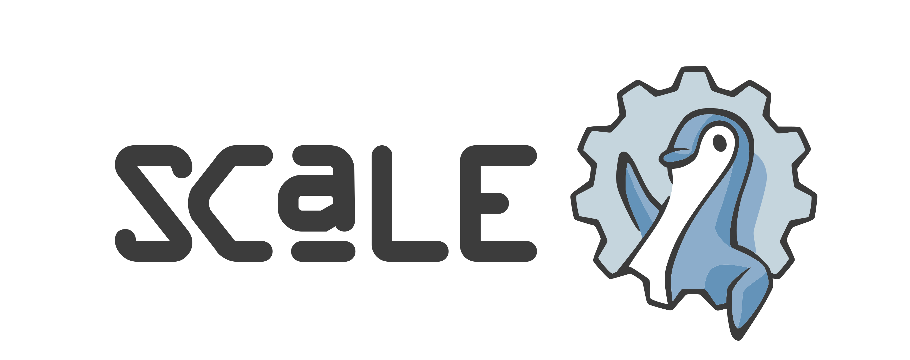

+++
date = '2025-04-28T12:00:00+02:00'
draft = false 
title = 'SCALE 22x'
+++

I attended the South California Linux Expo better known as [SCALE](https://www.socallinuxexpo.org) for its 22nd edition. For this occasion a CTF (2 actually but I didn't try the other one as it was at the same time) was organised by pacific hackers.    
The CTF lasted 2h30 and me and a friend were able to get first place.  

